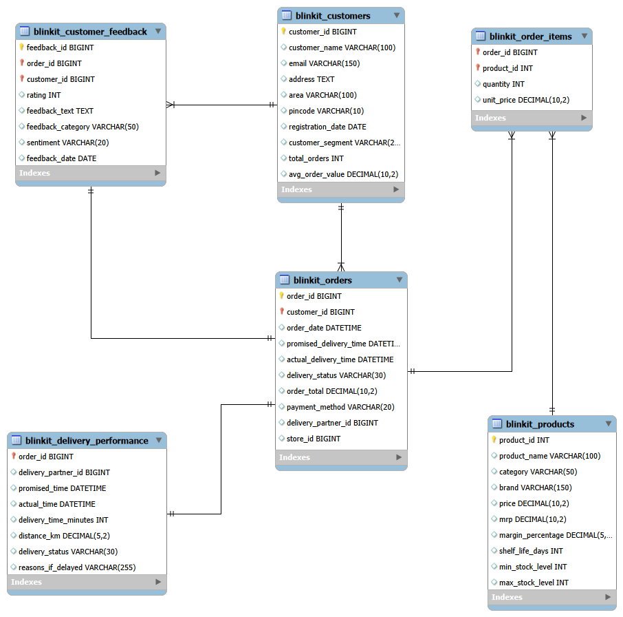

# 🛒 Blinkit Sales & Operations Analysis Using SQL

> **An end-to-end SQL analytics project analyzing sales performance, customer behavior, product performance, delivery operations, payment methods, and customer feedback using MySQL.**

---

## 🔍 Project at a Glance

| 📦 Orders | 👥 Customers | 🛍️ Products | 🗄️ Tables | ❓ Business Questions |
| :-------: | :----------: | :----------: | :--------: | :------------------: |
| *5,0000* |   *2,500*  |    *268*   |    *6*   |        *20*        |

| 🐬 Database | 🔍 Analysis | 🧹 Data Preparation |   💻 Primary Tool   |
| :---------: | :---------: | :-----------------: | :-----------------: |
|  *MySQL*  |   *SQL*   |   *Excel + SQL*   | *MySQL Workbench* |

---

## 📋 Project Overview

Quick-commerce businesses operate in an environment where **sales performance, customer behavior, product availability, delivery reliability, and customer satisfaction** all influence business growth.

This project analyzes a Blinkit-style quick-commerce dataset to answer key business questions using **MySQL and advanced SQL techniques**.

The analysis goes beyond basic reporting by examining:

* 📈 Sales trends and month-over-month performance
* 👥 Customer purchasing behavior and segmentation
* 🛒 Product and category performance
* 🚚 Delivery reliability and recurring delays
* 😊 Customer ratings and sentiment
* 💳 Payment method usage

The objective is to transform raw transactional data into **actionable business insights that can support operational and commercial decisions.**

---

## ⚠️ Business Problem

For a quick-commerce business, increasing order volume alone does not provide a complete picture of business performance.

Management needs to understand:

* **Where is sales performance improving or declining?**
* **Which customers and customer segments contribute most to sales?**
* **Which products are driving category performance?**
* **How significant are delivery delays?**
* **Are certain customers repeatedly experiencing delivery issues?**
* **What are customers most dissatisfied with?**
* **Does delivery performance appear to influence customer satisfaction?**
* **Which payment methods are most commonly used?**

Without structured analysis, these patterns can remain hidden within thousands of individual transactions.

### 💡 Business Goal

Use SQL to identify meaningful patterns across **sales, customers, products, delivery operations, and customer feedback**, and translate those findings into practical recommendations for improving **revenue performance, customer retention, operational reliability, and customer experience.**

---

## 🎯 Project Objectives

The project focuses on five major analytical areas:

### 📈 Sales & Order Performance

* Analyze monthly order value
* Calculate month-over-month changes
* Identify top-performing months
* Track cumulative order value

### 👥 Customer Behavior

* Identify high-value customers
* Compare customer segments
* Analyze time between purchases
* Track changes in customer order values
* Identify consecutive increases in spending

### 🛒 Product & Category Performance

* Identify top-performing products
* Compare products within categories
* Calculate product contribution to category sales
* Measure the gap between leading products

### 🚚 Delivery Performance

* Measure delivery status distribution
* Compare individual delivery times with the overall average
* Identify customers experiencing repeated delays

### 😊 Customer Satisfaction

* Analyze negative sentiment by feedback category
* Compare ratings across delivery performance
* Examine the relationship between delivery performance and customer sentiment

---

## 🔗 Data Source

The dataset used in this project is the **Blinkit Sales Dataset**, sourced from Kaggle.

**Source:** [Blinkit Sales Dataset – Kaggle](https://www.kaggle.com/datasets/akxiit/blinkit-sales-dataset/data)

The dataset contains information covering customers, orders, products, order items, delivery performance, and customer feedback.

---

## 📊 Dataset Overview

The project uses **six related tables** containing customer, order, product, delivery, and feedback data.

### 1. `blinkit_customers`

Contains customer-level information.

| Column              | Description                  |
| ------------------- | ---------------------------- |
| `customer_id`       | Unique customer identifier   |
| `customer_name`     | Customer name                |
| `email`             | Customer email               |
| `address`           | Customer address             |
| `area`              | Customer area                |
| `pincode`           | Customer pincode             |
| `registration_date` | Customer registration date   |
| `customer_segment`  | Customer segment             |
| `total_orders`      | Recorded total orders        |
| `avg_order_value`   | Recorded average order value |

### 2. `blinkit_orders`

Contains order-level transactional information.

| Column                   | Description                   |
| ------------------------ | ----------------------------- |
| `order_id`               | Unique order identifier       |
| `customer_id`            | Customer who placed the order |
| `order_date`             | Date of order                 |
| `promised_delivery_time` | Promised delivery time        |
| `actual_delivery_time`   | Actual delivery time          |
| `delivery_status`        | Delivery performance status   |
| `order_total`            | Recorded total order value    |
| `payment_method`         | Payment method                |
| `delivery_partner_id`    | Delivery partner identifier   |
| `store_id`               | Store identifier              |

### 3. `blinkit_order_items`

Contains product-level information associated with orders.

| Column       | Description        |
| ------------ | ------------------ |
| `order_id`   | Associated order   |
| `product_id` | Product identifier |
| `quantity`   | Quantity purchased |
| `unit_price` | Price per unit     |

### 4. `blinkit_products`

Contains product information.

| Column              | Description                |
| ------------------- | -------------------------- |
| `product_id`        | Unique product identifier  |
| `product_name`      | Product name               |
| `category`          | Product category           |
| `brand`             | Product brand              |
| `price`             | Product price              |
| `mrp`               | Maximum retail price       |
| `margin_percentage` | Product margin percentage  |
| `shelf_life_days`   | Product shelf life in days |
| `min_stock_level`   | Minimum stock level        |
| `max_stock_level`   | Maximum stock level        |

### 5. `blinkit_delivery_performance`

Contains delivery-level operational information.

| Column                  | Description                     |
| ----------------------- | ------------------------------- |
| `order_id`              | Associated order                |
| `delivery_partner_id`   | Delivery partner identifier     |
| `promised_time`         | Promised delivery time          |
| `actual_time`           | Actual delivery time            |
| `delivery_time_minutes` | Total delivery time in minutes  |
| `distance_km`           | Delivery distance in kilometers |
| `delivery_status`       | Delivery performance status     |
| `reasons_if_delayed`    | Reason for delivery delay       |

### 6. `blinkit_customer_feedback`

Contains customer feedback and sentiment information.

| Column              | Description                    |
| ------------------- | ------------------------------ |
| `feedback_id`       | Unique feedback identifier     |
| `order_id`          | Associated order               |
| `customer_id`       | Customer identifier            |
| `rating`            | Customer rating                |
| `feedback_text`     | Customer feedback              |
| `feedback_category` | Feedback category              |
| `sentiment`         | Positive, Neutral, or Negative |
| `feedback_date`     | Feedback submission date       |

---

## 🧹 Data Cleaning & Quality Checks

Before performing the analysis, the dataset was reviewed and cleaned to improve data reliability.

Key checks included:

* 🔎 Checked duplicate customer IDs, names, and emails
* 📍 Validated pincode lengths
* 👥 Identified customers with no recorded orders
* 📦 Checked product and brand uniqueness
* 🚚 Validated delivery-status classifications
* 💰 Checked order-value ranges and invalid values
* 🔄 Compared stored customer metrics with actual order data
* 🧮 Validated the relationship between order-level and product-level sales values

### ⚠️ Important Data Quality Finding

The stored customer metrics such as `total_orders` and `avg_order_value` were not consistently aligned with the actual order transactions.

Therefore, the analysis uses **actual order-level transactions** rather than relying on those stored customer metrics.

Another important validation found that:

> `order_total` did not consistently equal `quantity × unit_price`.

Therefore:

* **Order/customer-level analysis** uses `blinkit_orders.order_total`
* **Product-level sales analysis** uses `quantity × unit_price`

This prevents inconsistent calculations from being mixed across different levels of analysis.

---

## 🔍 Analytical Approach

The project followed a structured analytics workflow:

```text
Raw Data
    ↓
Data Cleaning
    ↓
Data Quality Checks
    ↓
MySQL Database
    ↓
Data Validation
    ↓
SQL Analysis
    ↓
20 Business Questions
    ↓
Business Insights
    ↓
Recommendations
```

The workflow was designed to ensure that the analysis was based on **validated and appropriately structured data** rather than directly querying raw files.

---

## 🗄️ Database Structure

The six tables were connected using key relationships such as:

* `customer_id`
* `order_id`
* `product_id`
* `delivery_partner_id`

The data model provides the structure used to connect customer, order, product, delivery, and feedback information.



---

## 📁 Project Structure

```text
📁 blinkit-sql-analysis/
│
├── 📁 data/
│    ├── raw/
│    └── cleaned/
│
├── 📁 data_model/
│    └── blinkit_data_model.png
│
├── 📁 sql/
│    └── blinkit_analysis.sql
│
└── 📄README.md
```

### 📂 Folder Description

| Folder/File     | Purpose                            |
| --------------- | ---------------------------------- |
| `data/raw/`     | Original dataset files             |
| `data/cleaned/` | Cleaned datasets used for analysis |
| `data_model/`   | Database relationship diagram      |
| `sql/`          | SQL queries used for the analysis  |
| `README.md`     | Project documentation              |

---

# 📊 SQL Analysis — 20 Business Questions

The analysis was divided into five business-focused groups.

## 📈 Group 1 — Sales & Order Performance

**Q1.** How did monthly order value change compared with the previous month?

**Q2.** What is the cumulative order value over each month?

**Q3.** Which are the top 3 months based on total order value?

**Q4.** Which months had the highest month-over-month increase and the highest month-over-month decline in order value?

---

## 👥 Group 2 — Customer Behavior & Segmentation

**Q5.** Who are the top 10 customers based on their total recorded order value, and what percentage of overall order value does each customer contribute?

**Q6.** Which customer segments generate higher sales per customer?

**Q7.** How many days does each customer wait between consecutive orders?

**Q8.** For each customer, did their order value increase or decrease compared with their previous order?

**Q9.** Which customers had a sequence of 3 consecutive orders with increasing order values?

---

## 🛒 Group 3 — Product & Category Performance

**Q10.** What are the top 3 products by sales value within each product category?

**Q11.** What percentage of each category's total sales value is contributed by each product?

**Q12.** Which products have sales value above the average product sales value of their category?

**Q13.** For each category, what is the difference between the top-selling product and the second-highest-selling product?

---

## 🚚 Group 4 — Delivery Performance

**Q14.** What percentage of total orders were delivered On Time, Slightly Delayed, and Significantly Delayed?

**Q15.** Which deliveries perform better or worse than the overall average delivery time?

**Q16.** Which customers experienced repeated delayed deliveries?

---

## 😊 Group 5 — Customer Satisfaction & Advanced Insights

**Q17.** Which feedback categories have the highest negative sentiment rate?

**Q18.** Does delivery performance affect customer ratings and sentiment?

**Q19.** What percentage of total orders does each payment method account for?

**Q20.** Which customers contribute the most to total sales within each customer segment?

---

# 🧠 SQL Techniques Used

The project demonstrates practical SQL techniques commonly used in Data Analyst roles:

### Core SQL

* `SELECT`
* `WHERE`
* `GROUP BY`
* `HAVING`
* `ORDER BY`
* `CASE WHEN`
* Aggregate functions

### Joins

* `INNER JOIN`, `LEFT JOIN`, `RIGHT JOIN`, `SELF JOIN`, `CROSS JOIN`
* Multi-table joins

### CTEs

* Common Table Expressions (CTEs)
* Multi-step analytical queries
* Breaking complex analysis into readable steps

### Window Functions

* `LAG()`
* `SUM() OVER()`
* `ROW_NUMBER()`
* `RANK()`
* `DENSE_RANK()`
* Windowed aggregations

### Advanced Analysis

* Running totals
* Month-over-month analysis
* Percentage contribution
* Category-level ranking
* Consecutive-order analysis
* Previous-order comparisons
* Average-based comparisons
* Conditional aggregation

---

# 💡 Key Business Insights

### 📈 1. Sales showed strong growth but became volatile later in the year

March recorded the highest month-over-month increase at **49.71%**, while November recorded the largest decline at **43.02%**.

May was the strongest month by total order value, generating approximately **₹11.82 lakh**.

**Business implication:** The sharp movement between months suggests that management should investigate the factors behind the strong March–May performance and the significant November decline.

---

### 👥 2. Revenue is relatively diversified across individual customers

The highest individual customer contribution was only **0.20%** of total order value.

**Business implication:** The business is not heavily dependent on a small number of individual customers, reducing concentration risk at the customer level.

---

### 🧑‍🤝‍🧑 3. New customers generated the highest average sales per customer

The **New** customer segment recorded the highest average sales per customer at approximately **₹5,275**.

**Business implication:** Understanding what drives higher initial spending could help the business convert new customers into repeat purchasers.

---

### 🛒 4. Product performance varies significantly across categories

Each category has different leading products, while the gap between the first- and second-ranked products also varies.

For example, the Baby Care category had a leader-to-second-place sales gap of approximately **₹23,780**, while Pharmacy had a gap of only **₹39**.

**Business implication:** Inventory and merchandising strategies should be tailored to individual categories rather than applying the same approach across the entire product range.

---

### 🚚 5. Delivery delays represent a significant operational issue

Out of 5,000 orders:

* 🟢 **69.40%** were On Time
* 🟡 **20.74%** were Slightly Delayed
* 🔴 **9.86%** were Significantly Delayed

Overall, **30.60% of orders experienced some level of delay**.

**Business implication:** Delivery reliability represents a meaningful operational improvement opportunity, particularly for significantly delayed orders.

---

### 🔁 6. Some customers experienced repeated delivery delays

The analysis identified customers who experienced multiple delayed deliveries, with some customers experiencing **four delayed deliveries**.

**Business implication:** Repeated delays may indicate recurring operational issues associated with particular customer locations, routes, stores, or delivery patterns.

---

### 😊 7. Product quality generated the highest negative sentiment

Among the analyzed feedback categories:

| Feedback Category | Negative Sentiment Rate |
| ----------------- | ----------------------: |
| Product Quality   |              **34.56%** |
| Customer Service  |                  32.94% |
| App Experience    |                  31.99% |
| Delivery          |                  31.86% |

**Business implication:** Product quality deserves attention as it generated the highest proportion of negative feedback.

---

### 🚚 8. Delivery performance showed only a weak relationship with customer satisfaction

Average ratings were:

* On Time: **3.33**
* Slightly Delayed: **3.39**
* Significantly Delayed: **3.33**

Negative sentiment ranged from approximately **31.86% to 34.08%** across delivery categories.

**Business implication:** While delivery reliability should still be improved, the results suggest that delivery performance alone may not explain most customer dissatisfaction. Other factors—particularly product quality—may require greater attention.

---

# 💼 Business Recommendations

Based on the analysis, the following actions could be considered:

### 🚚 Improve Delivery Reliability

Focus on reducing significantly delayed orders by investigating recurring operational patterns such as:

* Delivery distance
* Store-level patterns
* Routes
* Delay reasons
* Repeated customer-level delays

### 🛒 Prioritize High-Performing Products

Ensure leading products within each category have sufficient availability, particularly where there is a large gap between the leading product and the next-best performer.

### 😊 Investigate Product Quality Issues

Since Product Quality has the highest negative sentiment rate, management should investigate recurring product-quality complaints and identify their underlying causes.

### 👥 Convert New Customers into Repeat Customers

Since the New segment generates the highest average sales per customer, the business could investigate which products or purchasing patterns contribute to this behavior and develop strategies to encourage repeat purchases.

### 📉 Investigate Significant Sales Declines

The sharp **43.02% decline in November** warrants further investigation to determine whether the decline was related to customer demand, product availability, operational issues, or other factors.

---

# 🏁 Conclusion

This project demonstrates how SQL can be used to move from **raw transactional data to business-focused insights**.

By combining sales, customer, product, delivery, payment, and feedback data, the analysis provides a broader view of quick-commerce performance.

The key findings highlight three major areas of opportunity:

> **📈 Understand sales volatility → 🚚 Improve operational reliability → 😊 Strengthen customer experience**

More importantly, the project demonstrates the ability to:

* Clean and validate data
* Structure relational datasets
* Write analytical SQL queries
* Apply CTEs and window functions
* Analyze trends and customer behavior
* Identify operational issues
* Translate data findings into business recommendations

---

# 🛠️ Tools Used

* **MySQL** — Database management and SQL analysis
* **Microsoft Excel** — Initial data cleaning and validation
* **GitHub** — Project documentation

---

## ⭐ Key Takeaway

**The goal of this project was not just to write SQL queries, but to use SQL to answer real business questions and turn data into decisions.**
